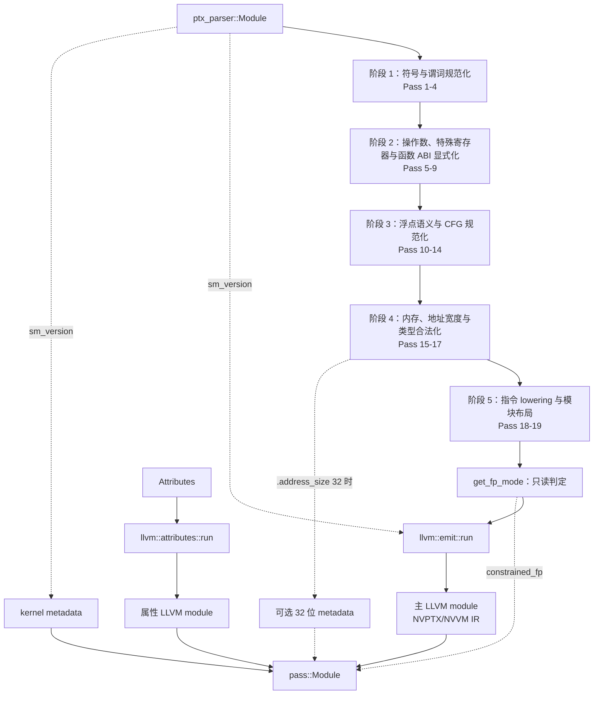

# PTX 到 NVVM LLVM IR：Pass Pipeline 详解

## 1. 文档范围

本文解释当前 `ptx` crate 从 `ptx_parser::Module` 到 NVPTX/NVVM LLVM IR 的实际转换过程。这里的“实际”是指以 `ptx/src/pass/mod.rs` 中 `to_llvm_module()` 的调用顺序为准，而不是按源码文件名推测，也不是描述一个理想化的 PTX 编译器。

这条 pipeline 的最终产物是面向 NVIDIA NVPTX 后端的 LLVM IR：kernel 使用 PTX kernel calling convention，kernel 参数位于 NVPTX 参数地址空间，特殊寄存器和部分设备操作使用 `llvm.nvvm.*` intrinsic，函数带有由输入 PTX `.target` 推导出的 `target-cpu`，例如 `sm_110`。它不是最终 SASS，也没有在这里执行 LLVM 的 NVPTX codegen。换句话说，本文覆盖的是：

```text
PTX 文本 -> PTX AST -> 规范化中间表示 -> NVPTX/NVVM LLVM IR
```

不覆盖：

```text
NVPTX/NVVM LLVM IR -> PTX 或机器码 -> cubin -> SASS
```

理解这套代码时，最重要的一点是：它并不是拿到一条 PTX 指令就立即生成一条 LLVM 指令。PTX 允许名称作用域、指令谓词、复合操作数、隐式类型转换、`.param` 调用约定、指令级浮点模式和多种状态空间共同存在；LLVM IR 则要求值、类型、控制流和地址空间都足够明确。因此，大多数 pass 的职责不是“优化”，而是逐层消除 PTX 的隐式语义，建立后续阶段可以依赖的不变量。只有当这些语义都被显式化之后，`llvm::emit::run` 才真正创建 LLVM 类型、基本块、指令、intrinsic 和属性。

## 2. 精确执行顺序

入口位于 [`ptx/src/pass/mod.rs`](ptx/src/pass/mod.rs) 的 `to_llvm_module()`。当前顺序如下：

1. `normalize_identifiers`
2. `replace_known_functions`
3. `normalize_predicates`
4. `optimize_function_arguments`
5. `resolve_function_pointers`
6. `fix_special_registers`
7. `expand_operands`
8. `insert_post_saturation`
9. `deparamize_functions`
10. `rcp_f64_into_div`
11. `replace_instructions_with_functions_fp_required`
12. `normalize_basic_blocks`
13. `remove_unreachable_basic_blocks`
14. `instruction_mode_to_global_mode`
15. `insert_explicit_load_store`
16. `convert_32bit_to_64bit`，仅当 PTX 声明 `.address_size 32` 时执行
17. `insert_implicit_conversions`
18. `replace_instructions_with_functions`
19. `hoist_globals`
20. `get_fp_mode`，这是只读判定，不是变换 pass
21. `llvm::emit::run`，生成主 LLVM module
22. `llvm::attributes::run`，生成属性 LLVM module

主 module 和属性 module 都生成以后，入口统一调用 `on_pass_end("emit_llvm")`；因此回调层只观察到一个 `emit_llvm` 阶段名，并没有独立的 `emit_attributes` 回调。

可以把 directives 的变换概括为五个连续收敛阶段。完成这些变换后，主 NVVM IR、属性 module 和 metadata 分别生成，最后才聚合为 `pass::Module`：



这不是任意排列。前面的 pass 不断缩小后面 pass 需要处理的输入集合。例如，`expand_operands` 之后，指令 visitor 不再需要同时理解立即数、寄存器偏移和向量成员；`normalize_basic_blocks` 之后，浮点模式分析可以在稳定 CFG 上工作；`insert_implicit_conversions` 之后，LLVM 发射器不需要猜测 PTX 允许的隐式位转换或宽度变化。

## 3. 中间表示如何逐步变化

解析器最初产生的操作数仍然带有 PTX 文本层面的结构，名称以字符串或字符串引用存在。pipeline 前半段将它逐渐变为内部 ID，并将复合语句展开：

```text
ptx_parser::Module
  directives: Directive<ParsedOperand<&str>>

    | normalize_identifiers
    v

NormalizedDirective2
  名称: SpirvWord
  操作数: ParsedOperand<SpirvWord>
  指令仍可携带 Option<PredAt>

    | normalize_predicates
    v

UnconditionalDirective
  指令本身不再携带谓词
  谓词已变成 Statement::Conditional 和 Label

    | expand_operands
    v

Directive2<Instruction<SpirvWord>, SpirvWord>
  立即数、寄存器偏移、向量成员等已变成显式 statement

    | 后续语义 pass
    v

ExpandedStatement 序列
  可含 Constant、Conversion、PtrAccess、SetMode、Call、Label 等

    | llvm::emit::run
    v

llvm_zluda::utils::Module
```

`SpirvWord` 在这里主要充当唯一内部 ID。名称虽然沿用了 SPIR-V 风格的整数标识，但这条目标路径最终发射的是 LLVM IR。`GlobalStringIdentResolver2` 保存 ID 到原始名称、类型和状态空间的映射；后续 pass 创建临时值时，也通过 resolver 分配新 ID 并登记类型。这个集中式符号表是整条 pipeline 的骨架：如果一个临时值没有准确的类型和状态空间，后面的操作数展开、隐式转换和 LLVM 类型映射都会失去依据。

## 4. 第一阶段：建立稳定的符号和控制流语言

### 4.1 `normalize_identifiers`

源码：[`ptx/src/pass/normalize_identifiers.rs`](ptx/src/pass/normalize_identifiers.rs)

这是所有后续 pass 的符号基础。输入 AST 中的函数、变量、寄存器、标签和操作数仍以 PTX 名称表示，而且名称的含义受作用域约束。该 pass 使用 `ScopedResolver` 解析定义和引用，为每个可引用实体分配唯一 `SpirvWord`，并把已知的类型和状态空间写入扁平 resolver。输出中的指令仍然可以带谓词，操作数也仍然是 `ParsedOperand`，但“这个名字到底指向哪个定义”已经不再需要后续 pass 重复判断。

这一阶段建立的关键不变量是：合法符号引用都已经绑定到唯一 ID；同名但不同作用域的实体不会在后续变换中混淆；能够静态确定的类型和状态空间可以通过 resolver 查询。它必须位于第一位，因为后面的特殊寄存器识别、函数识别、临时值创建和类型转换都基于 ID，而不是基于字符串比较。

### 4.2 `replace_known_functions`

源码：[`ptx/src/pass/replace_known_functions.rs`](ptx/src/pass/replace_known_functions.rs)

这个 pass 在符号已经解析、但调用结构尚未被大规模改写时，替换少量已知外部函数的链接名称。当前典型对象包括 `vprintf` 和 `__assertfail` 一类需要由配套实现库提供的入口，它们会被重定向到 `__zluda_ptx_impl_*` 命名空间。

它不改变函数签名，也不是通用的指令 lowering。它解决的是链接边界问题：PTX 中约定俗成的运行时函数名，不应误绑定到宿主环境中同名但 ABI 不同的函数。把重命名放在早期，可以让后续 call、声明生成和 helper bitcode 链接始终看到同一个最终符号。

### 4.3 `normalize_predicates`

源码：[`ptx/src/pass/normalize_predicates.rs`](ptx/src/pass/normalize_predicates.rs)

PTX 允许几乎每条指令写成 `@%p instruction` 或 `@!%p instruction`。这种指令级条件执行与 LLVM 的基本块和 terminator 模型不一致。该 pass 因而把谓词从指令上拿掉，改写为显式的 `Statement::Conditional`、真实执行标签和跳过标签。

对于普通谓词指令，逻辑形态近似为：

```text
@p instruction

    -> conditional p, execute_label, skip_label
       execute_label:
         instruction
       skip_label:
```

对于谓词化的 `bra`，实现会把原跳转目标直接折叠到条件分支的 true 或 false 目标中，不再额外保留一个只包含 `bra` 的执行块。`@!p` 则通过交换 true/false 目标表达取反，而不是额外生成逻辑非指令。

这一阶段之后，“每条 `Instruction` 都无条件执行”成为后续 pass 的不变量。条件性已经完全进入 statement/CFG 层。它要早于基本块规范化，因为它本身会创建标签和控制流边；也要早于浮点模式分析，因为一条谓词浮点指令是否执行，会直接决定对应 CFG 路径上的模式需求。

### 4.4 `optimize_function_arguments`

源码：[`ptx/src/pass/optimize_function_arguments.rs`](ptx/src/pass/optimize_function_arguments.rs)

这个 pass 的名字容易让人误以为它执行通用 ABI 优化。实际行为很窄：对于 `.param` 空间中的一维 `b8` 数组参数或局部参数变量，把元素类型改成 `b32`，维度变为原字节数除以四并向上取整；call 签名中的相应参数类型也同步处理。非 kernel 函数的输入和返回参数会参与转换，kernel 入口参数不在这一分支中改写。

源码注释明确说明它起源于 AMDGPU 路径上的参数效率问题。因此，在当前 NVPTX/NVVM 路径中应把它理解为保留下来的表示规范化，而不是 NVIDIA ABI 的必要规则。它仍然重要，因为 resolver 中登记的类型和 AST 中的参数类型必须同步更新；一旦后面的 `deparamize_functions` 和 call lowering 开始生成临时值，再做这种数组重排会明显更困难。

## 5. 第二阶段：消除特殊操作数和调用约定

### 5.1 `resolve_function_pointers`

源码：[`ptx/src/pass/resolve_function_pointers.rs`](ptx/src/pass/resolve_function_pointers.rs)

PTX 用普通 `mov.u64` 表达“取得函数地址”时，表面上与整数寄存器复制相似。该 pass 先收集非 kernel 函数 ID，再识别源操作数是函数符号的 `mov.u64`，将其替换为专门的 `Statement::FunctionPointer { dst, src }`。如果承载函数地址的 move 不是 `u64`，实现会报告类型不匹配。

这一步的意义是区分两个在语法上相近、在 LLVM 中完全不同的动作：复制一个 64 位整数，和产生一个函数值/函数地址。完成后，LLVM 发射器不需要根据 `mov` 的操作数重新猜测符号类别。它必须位于标识符规范化之后，因为只有 resolver 已经知道哪些 ID 是函数，才能可靠识别这一模式；它又要位于 `expand_operands` 之前，因为此时 `mov` 仍保留可用于模式匹配的 `ParsedOperand::Reg` 结构。

### 5.2 `fix_special_registers`

源码：[`ptx/src/pass/fix_special_registers.rs`](ptx/src/pass/fix_special_registers.rs)

`%tid.x`、`%ctaid.y`、`%ntid.z`、`%laneid` 和 `%clock` 等 PTX 特殊寄存器不是普通用户寄存器。当前 NVVM 路径将这些读取转换为对应的外部函数/intrinsic 调用，并补充所需声明。例如：

```text
%tid.x   -> llvm.nvvm.read.ptx.sreg.tid.x()
%ntid.y  -> llvm.nvvm.read.ptx.sreg.ntid.y()
%ctaid.z -> llvm.nvvm.read.ptx.sreg.ctaid.z()
```

`SpecialRegistersMap` 在 pipeline 开始时注册这些预定义实体，pass 在遍历操作数时将特殊 ID 替换为普通临时 ID，并在当前 statement 前插入 call。这样，从后续 pass 的视角看，特殊寄存器读取已经退化成“调用一个有确定返回类型的函数，然后使用返回值”。x/y/z 分量分别映射到独立 NVVM intrinsic，而不是先读取一个向量再抽取分量。

这个 pass 要早于 `expand_operands`，因为它需要识别解析后但尚未完全扁平化的特殊操作数；转换出的返回值又必须像普通值一样参与后面的偏移展开、load/store 和隐式类型检查。

### 5.3 `expand_operands`

源码：[`ptx/src/pass/expand_operands.rs`](ptx/src/pass/expand_operands.rs)

这是表示形态的一次重要收敛。输入指令仍可能包含立即数、`register + offset`、变量地址、向量成员等 `ParsedOperand` 变体；输出指令的所有操作数统一为 `SpirvWord`。原来嵌在操作数内部的计算，会被提升为位于主指令之前或之后的独立 statement。

例如，立即数会先成为 `Statement::Constant` 并获得一个有类型的 ID。寄存器偏移如果作用于 `.reg` 值，会生成常量和整数 `add`；如果作用于可寻址状态空间中的对象，则生成 `Statement::PtrAccess`。向量成员读取和写回也会通过临时值及前后 statement 展开，而不是继续藏在操作数语法里。

此后建立的不变量非常强：指令 visitor 只需要处理 ID，不需要为每一种参数位置重复实现立即数、偏移和向量成员逻辑。resolver 同时知道所有新 ID 的类型和空间。后续几乎所有语义 pass 都依赖这一点，所以它是“解析层 AST”和“编译器内部 statement IR”之间的分界。

### 5.4 `insert_post_saturation`

源码：[`ptx/src/pass/insert_post_saturation.rs`](ptx/src/pass/insert_post_saturation.rs)

PTX 的某些浮点算术和浮点转换带 `.sat` 修饰符，语义不是换一种加法或转换本身，而是先得到运算结果，再把结果限制到规定区间。该 pass 将带饱和标志的原指令改写为一个写入临时值的非饱和指令，再追加显式的后处理，将临时结果饱和后写入原目标。

把 saturation 从原指令拆出来有两个好处。第一，后续指令发射只需要实现普通算术/转换和一套统一的饱和逻辑，不必为每个 opcode 复制 `.sat` 分支。第二，浮点模式分析看到的主体运算仍保留原有舍入和 FTZ 需求，而饱和操作作为独立步骤存在。它必须在复杂指令被替换为 helper call 之前运行，否则 `.sat` 修饰符会随原 opcode 一起消失，难以再恢复精确的“运算后饱和”顺序。

### 5.5 `deparamize_functions`

源码：[`ptx/src/pass/deparamize_functions.rs`](ptx/src/pass/deparamize_functions.rs)

这是函数 ABI 规范化 pass，而不是简单删除 `.param`。PTX 普通函数经常通过调用者创建的 `.param` 槽传入参数和接收返回值；LLVM 函数则更自然地把输入表示成 SSA 参数、把返回值表示成函数返回值。该 pass 在两种模型之间建立桥接，并且明确不对 kernel 使用同一规则，因为 kernel 参数需要保留入口参数空间语义。

对非 kernel 函数定义，`.param` 输入参数会在函数签名中改成新的 `.reg` 参数，同时在函数体开头重建原 `.param` 局部变量，并插入 `st.param`，把新的 ABI 参数写入原 PTX 参数槽。`.param` 返回参数也在签名中改成新的 `.reg` 返回值；函数体继续使用原参数槽，在每个 `ret` 前插入 `ld.param`，把槽中的结果读到新的返回寄存器。

对 call site，方向正好相反：调用前把调用者 `.param` 输入槽通过 `ld.param` 读到新的 `.reg` call 参数；调用返回值先落到新的 `.reg` 临时值，再通过 `st.param` 写回调用者原有的返回槽。于是该 pass 前后两侧分别保留了 PTX 函数体/调用点的参数槽语义，同时把真正跨函数边界的值改造成 LLVM 可直接表达的寄存器 ABI。

这个 pass 必须先于 `insert_explicit_load_store`。前者决定哪些 `.param` 是函数调用约定的桥接槽以及何时读写，后者才有足够信息统一变量的内存表示。两者顺序颠倒会把 ABI 语义和普通局部变量 lowering 混在一起。

## 6. 第三阶段：浮点语义与 CFG

### 6.1 `rcp_f64_into_div`

源码：[`ptx/src/pass/rcp_f64_into_div.rs`](ptx/src/pass/rcp_f64_into_div.rs)

实现会把 `RcpKind::Compliant` 的倒数指令展开为常量 `1.0` 加同类型浮点除法，即 `rcp(x) -> div(1.0, x)`，并保留原来的舍入模式和 FTZ 标志。尽管文件名带 `f64`，当前匹配逻辑依据 `RcpKind::Compliant` 和指令携带的标量类型构造新指令，理解行为时应以源码匹配条件而不是文件名为准。

这个变换使 compliant reciprocal 复用统一的浮点除法语义和后续模式处理，而 approximate reciprocal 仍可以走 NVVM intrinsic 或专用 lowering。它要位于浮点模式分析之前，因为新产生的 `div` 必须参与模式需求计算；如果在模式分析之后才展开，新增除法的舍入与 FTZ 约束就不会反映到 CFG 上。

### 6.2 `replace_instructions_with_functions_fp_required`

源码：[`ptx/src/pass/replace_instructions_with_functions_fp_required.rs`](ptx/src/pass/replace_instructions_with_functions_fp_required.rs)

这个 pass 不是通用的“指令替换成函数”，而是专门处理无法在浮点模式分析之后再安全替换的除法情况，尤其是 `div.rn.ftz.f32` 一类实现内部不同阶段需要不同 FTZ 状态的操作。当前方案把原除法拆为两个外部 helper 调用，并插入 `Statement::FpModeRequired` 作为零成本的语义标记：第一部分要求关闭 FTZ，第二部分要求打开 FTZ。必要的 f32/f64 helper 声明也在模块级补入。

这里的关键不是函数调用本身，而是“在原始指令消失前保存模式需求”。后面的 `instruction_mode_to_global_mode` 会读取 `FpModeRequired`，把这些局部要求纳入全函数 CFG 数据流。如果把这项替换放到模式 pass 之后，helper 内部所需的模式切换只能靠 helper 自己读取和恢复硬件状态，复杂且难以优化。

### 6.3 `normalize_basic_blocks`

源码：[`ptx/src/pass/normalize_basic_blocks.rs`](ptx/src/pass/normalize_basic_blocks.rs)

前面的谓词展开和指令改写已经生成标签、条件边、call 和 return，但这些 statement 尚不一定满足后续分析期待的规范基本块形态。该 pass 补齐入口标签和必要的显式跳转，确保标签确实是块边界、terminator 确实结束基本块，并整理函数出口。对于普通函数，它还需要让返回路径具有后续 call/浮点模式分析可以推理的稳定结构。

这一阶段的目标不是做 LLVM 的 CFG 优化，而是建立一个语法明确的图：每个块有 ID，块间后继可以从 terminator 推导，隐式 fallthrough 被显式表达。`instruction_mode_to_global_mode` 必须在这个 pass 之后，因为模式 pass 需要沿每条 CFG 边传播状态；如果块边界还会变化，模式设置点就没有稳定含义。

### 6.4 `remove_unreachable_basic_blocks`

源码：[`ptx/src/pass/remove_unreachable_basic_blocks.rs`](ptx/src/pass/remove_unreachable_basic_blocks.rs)

该 pass 在规范 CFG 上从函数入口计算可达性，并删除不可达基本块。它位于浮点模式分析之前，原因不只是减少代码量：不可达块中的舍入或 FTZ 要求不应该参与全局模式约束，否则求解器可能为永远不会执行的路径插入模式切换，甚至让多个模式需求产生无意义的冲突。

这里执行的是前端 IR 清理，不应与 LLVM 后续的 `SimplifyCFG` 或 dead-code elimination 混为一谈。它服务于紧随其后的语义分析，保证分析输入只包含真实执行路径。

### 6.5 `instruction_mode_to_global_mode`

源码：[`ptx/src/pass/instruction_mode_to_global_mode/mod.rs`](ptx/src/pass/instruction_mode_to_global_mode/mod.rs)

这是 pipeline 中最复杂、也最有历史背景的 pass。PTX 将 `.rn`、`.rz`、`.rm`、`.rp`、`.ftz` 等模式附着在单条浮点指令上；原始 ZLUDA 的 AMDGPU 发射路径却需要把它们转换为控制流范围内的全局浮点环境。当前 pass 因而构建 CFG，分别分析 f32 与 f16/f64 的 denormal 和 rounding 状态，求出哪些边或哪些块前必须改变模式，再插入 `Statement::SetMode` 和必要的模式 prologue block。

分析不能只做“看到指令就在前面 set mode”。一个块可能有多个前驱，前驱退出时携带的模式不同；call 还要求正确处理调用者和被调用者的入口/退出模式。如果在每条指令前无条件设置，语义虽然更容易保证，但会产生大量冗余切换。实现通过控制流约束和 HiGHS 求解最小必要插入位置，然后将需要改变模式的边重定向到人工 prologue block，或者在块内合并相邻设置。

它建立的不变量是：凡是仍依赖特定浮点环境的 statement，在所有可达路径上都会先观察到正确的 `SetMode` 状态。随后 `get_fp_mode` 只需检查是否存在 `SetMode`，就能决定发射普通浮点 IR 还是 constrained FP IR。

需要特别注意的是，这个 pass 的设计动机和源码注释仍然是 AMDGPU 的全局模式模型。当前工程虽然已经把最终发射改到 NVPTX/NVVM，但该 pass 仍在 pipeline 中执行。因此文档不能把它描述成 NVVM 固有要求；更准确的说法是：当前前端保留了原 ZLUDA 的浮点语义归一化机制，最终 emitter 再依据 `FloatingPointMode` 选择 LLVM 浮点发射路径。这也是未来继续收敛 NVIDIA 原生语义时最值得单独审计的边界之一。

## 7. 第四阶段：内存、32 位地址和类型合法化

### 7.1 `insert_explicit_load_store`

源码：[`ptx/src/pass/insert_explicit_load_store.rs`](ptx/src/pass/insert_explicit_load_store.rs)

这个 pass 将函数体中的变量使用统一成显式内存访问形式。源码注释给出的规则很清楚：函数体内的 `.local`、`.param` 和 `.reg` 变量被归一到内部 `.local` 表示；对于原 `.reg` 变量，在每次需要读取或写回时插入显式 `ld`/`st`；已有 load/store 的状态空间随变量映射一起修正。这样做看似把寄存器“降级”为内存，实际目的是建立一种简单、统一、可由 LLVM 后续 mem2reg 恢复成 SSA 的 memory-SSA 前置形态，避免前端自己实现完整的 SSA 构造和 phi 插入。

kernel 参数在这里走单独路径。`.entry` 的输入参数从普通 `.param` 改成内部 `ParamEntry`，所有相关 load 的状态空间同步更新。最终 LLVM 类型映射会把 `ParamEntry` 放到 NVPTX 参数地址空间 `addrspace(101)`。普通 `.func` 输入参数已经在 `deparamize_functions` 中转成 `.reg` ABI 参数，所以这里不再按 kernel 参数规则处理。

该 pass 之后，变量究竟是值还是地址、一次使用是否需要 load、一次定义是否需要 store，都已经成为显式 statement。它必须早于 32 位地址转换，因为 32 位 pass 需要看到真实地址访问点；也必须早于隐式类型转换，因为 load/store 的最终源、目标类型和状态空间要先确定，才能判断需要 bitcast、扩展、截断还是取地址。

### 7.2 `convert_32bit_to_64bit`：条件 pass

源码：[`ptx/src/pass/convert_32bit_to_64bit.rs`](ptx/src/pass/convert_32bit_to_64bit.rs)

只有输入模块声明 `.address_size 32` 时才执行。它不是简单地把所有 `u32` 改成 `u64`，而是为 32 位 PTX 的指针语义建立一层 64 位承载模型，并返回额外的 `ModuleMetadata32Bit`。变换会调整 kernel 和全局对象相关表示，使后续阶段能在 64 位 LLVM 指针环境中区分普通 32 位整数、32 位伪地址以及最终可解引用地址。

条件执行非常重要：64 位 PTX 完全跳过此 pass，`metadata32` 保持 `None`。后面的 `insert_implicit_conversions` 会收到 `is_32bit` 标志，在地址空间变化和指针转换时采用对应规则。调试 32 位输入时，不能只看最终 LLVM IR，还应同时检查 `Module.metadata32`，因为部分重定位/参数解释信息并不只存在于指令流中。

### 7.3 `insert_implicit_conversions`

源码：[`ptx/src/pass/insert_implicit_conversions.rs`](ptx/src/pass/insert_implicit_conversions.rs)

PTX 的类型规则允许一些在 LLVM IR 中不能隐式发生的转换。典型情况包括同宽整数/位类型的 auto-bitcast、load/store 结果宽度与目标寄存器宽度不同、地址对象在寄存器语境中隐式取地址，以及 generic/global load/store 把 `b64/u64/s64` 当成指针使用。这个 pass 遍历每条 statement 的源和目标操作数，对照“操作数实际类型/空间”和“指令要求类型/空间”，在主指令前后插入 `Statement::Conversion`。

源操作数转换放在主 statement 前，目标操作数转换放在主 statement 后。例如，一条指令要求 `u32` 结果，但 PTX 允许结果写入更宽寄存器时，pass 会先让主指令写入一个精确 `u32` 临时值，再按 PTX 规则扩展或位转换到原目标。对于可寻址对象在 `.reg` 参数位置出现的情况，会生成 `AddressOf` 类转换。32 位模式下，空间转换还会使用专门的指针宽度规则。

这一阶段是 LLVM emitter 的类型防火墙。完成后，发射器可以按照 statement 上的明确类型创建 LLVM 指令，不必在每个 opcode 内重新实现 PTX 的隐式兼容矩阵。它要晚于显式 load/store，因为后者会改变操作数空间；又要早于通用 helper lowering，因为新生成的 call 参数同样需要类型精确。

## 8. 第五阶段：最终 lowering 和模块布局

### 8.1 `replace_instructions_with_functions`

源码：[`ptx/src/pass/replace_instructions_with_functions.rs`](ptx/src/pass/replace_instructions_with_functions.rs)

经过前述规范化后，仍有一批 PTX 操作不适合由通用 LLVM builder 直接表达，或者当前实现选择通过现成 helper/intrinsic 承载。这个 pass 将这些指令替换成明确签名的函数调用，收集并去重所需外部声明。目标名称如果是 `llvm.nvvm.*`，表示直接使用 NVVM intrinsic；其他 helper 通常进入 `__zluda_ptx_impl_*` 命名空间，并由配套 bitcode 提供实现。

当前 NVVM 改造中，`rcp`、`rsqrt`、`ex2`、`lg2`、部分 `sqrt` 等操作会在这里选择对应的 `llvm.nvvm.*` 名称；另一些复杂操作仍走 ZLUDA helper。这个边界不能只看 `llvm/emit.rs`：某条 PTX 指令如果已经在本 pass 中消失，最终 emitter 看到的只是 call。因此，增加新 NVVM intrinsic 支持时，必须同时确认该 opcode 是否在这里提前被 helper 化。

它被放在隐式转换之后，是为了让原 PTX 指令的类型规则先得到完整处理；被放在 `hoist_globals` 之前，则允许新增函数声明和仍存在于函数体中的变量一起接受最终模块布局整理。

### 8.2 `hoist_globals`

源码：[`ptx/src/pass/hoist_globals.rs`](ptx/src/pass/hoist_globals.rs)

PTX 函数体中可以出现 `.global`、`.const` 或 `.shared` 声明，但 LLVM 全局对象必须在 module 层创建。该 pass 扫描每个函数体，将这三类 `Statement::Variable` 提取为顶层 `Directive2::Variable`，并从原函数体删除声明。原有顶层 directive 保持原顺序，被提升的对象插入到所属函数 directive 之前。

这是发射前的模块结构整理，而不是数据搬运：使用这些变量的 ID 不变，resolver 中的类型/空间也不变。完成后，`llvm::emit::run` 可以统一遍历顶层变量并调用 global emitter，不需要在函数发射过程中临时修改 module 符号表。

### 8.3 `get_fp_mode`：只读决策点

源码：[`ptx/src/pass/mod.rs`](ptx/src/pass/mod.rs)

`get_fp_mode` 会扫描所有函数体，只要发现一个 `Statement::SetMode`，就返回 `FloatingPointMode::Constrained`；否则返回 `FloatingPointMode::Normal`。它不修改 directives，因此严格说不是 pass。`on_pass_end("get_fp_mode")` 只是沿用了统一的进度回调接口。

这个全模块判定会影响两个结果。第一，`llvm::emit::run` 选择普通或 constrained 的浮点发射路径。第二，`Module::linked_bitcode()` 选择 `ZLUDA_PTX_IMPL` 或 `ZLUDA_PTX_IMPL_CONSTRAINED` helper bitcode。也就是说，一个函数中的模式要求可能使整个 module 使用 constrained 配套实现，这是当前设计的模块级粒度。

## 9. LLVM/NVVM 发射阶段

### 9.1 `llvm::emit::run`

源码：[`ptx/src/pass/llvm/emit.rs`](ptx/src/pass/llvm/emit.rs)

这个阶段接收最终 resolver、directives、浮点模式和输入模块的 `sm_version`，使用 LLVM C API 构造主 module。此时前端语义已经充分显式化，emitter 的核心工作可以分为四类。

第一类是类型和地址空间映射。PTX scalar/vector/array 类型被转换成 LLVM 类型，状态空间被转换成 NVPTX 地址空间。特别是 kernel 参数使用内部 `ParamEntry`，对应 `addrspace(101)`；global、shared、const、local/generic 等空间也分别进入既定映射。由于 `insert_implicit_conversions` 已经处理空间不一致，emitter 不需要靠猜测决定某个整数究竟是不是地址。

第二类是函数与控制流构造。kernel 使用 `LLVMPTXKernelCallConv`，普通函数使用普通调用约定；函数参数、返回值、标签、条件分支和基本块根据规范化后的 statement 创建。`deparamize_functions` 已经把普通 PTX 函数的参数槽 ABI 转成寄存器 ABI，`normalize_basic_blocks` 已经给出稳定 CFG，因此这一层不再重建 PTX 调用约定或谓词语义。

第三类是逐 statement 发射。常量、load/store、算术、转换、原子、barrier、call、函数指针和 `PtrAccess` 等各自映射到 LLVM builder 操作或 NVVM intrinsic。前面 `replace_instructions_with_functions` 已经 lower 的操作在这里表现为普通 call；直接保留的 PTX opcode 则由 emitter 的对应分支生成 LLVM 指令。特殊寄存器同样已经变成 `llvm.nvvm.read.ptx.sreg.*` 调用。

第四类是 NVIDIA 目标信息。kernel calling convention、NVVM intrinsic、NVPTX 参数地址空间以及由 `sm_version` 生成的 `target-cpu` 共同表明该 module 面向 NVIDIA 后端。例如 PTX `.target sm_110` 会传播成 `sm_110` 目标 CPU 属性。在 debug 构建中，发射完成后 module 会经过 LLVM verifier；验证失败表示前面建立的类型、CFG 或地址空间不变量仍有缺口。release 构建中的当前实现不会自动执行这一步。

需要区分“NVVM 风格 LLVM IR”和“已经完成 NVIDIA codegen”。本函数只创建可供 NVPTX/NVVM 工具链继续处理的 LLVM module。它不会自行生成 cubin 或 SASS，也不能替代缺失的 NVPTX backend、`ptxas` 或驱动 JIT。

### 9.2 `llvm::attributes::run`

源码：[`ptx/src/pass/llvm/attributes.rs`](ptx/src/pass/llvm/attributes.rs)

属性发射器创建的是第二个独立 LLVM module，而不是继续修改主 module。当前它把 `Attributes.clock_rate` 发射成 constant 地址空间中的 hidden、external-linkage 全局常量，符号名位于 ZLUDA PTX 实现约定的命名空间。这个值供 helper 实现或后续链接阶段使用。

因此，`to_llvm_module()` 的结果包含 `llvm_ir` 和 `attributes_ir` 两个 module，外加 kernel metadata、可选的 32 位 metadata 以及 `constrained_fp` 标志。只打印 `llvm_ir` 足以观察主要 NVVM IR，但如果要复现完整链接输入，不能忽略属性 module 和由 `linked_bitcode()` 选择的 helper bitcode。

## 10. 一个 kernel 如何穿过整条 pipeline

考虑下面这个简化 PTX 片段：

```ptx
.version 9.0
.target sm_110
.address_size 64

.visible .entry scale(
    .param .u64 out,
    .param .f32 factor
)
{
    .reg .pred %p;
    .reg .b32 %r;
    .reg .b64 %rd;
    .reg .f32 %f;

    mov.u32 %r, %tid.x;
    ld.param.u64 %rd, [out];
    @%p ex2.approx.f32 %f, factor;
    st.global.u32 [%rd+4], %r;
    ret;
}
```

这不是为了展示每个语法细节都能由当前 parser 接受，而是用于说明各 pass 的职责边界。

首先，`normalize_identifiers` 为 `scale`、`out`、`factor`、寄存器、谓词和标签分配内部 ID。此时 `%r` 不再靠字符串身份区分，resolver 已知道它是 `.reg .b32`。`normalize_predicates` 将 `@%p ex2...` 拆成条件边、执行块和跳过块，使 `ex2` 本身变成无条件 statement。

接着，`fix_special_registers` 把 `%tid.x` 替换成 `llvm.nvvm.read.ptx.sreg.tid.x()` 的返回临时值。`expand_operands` 为地址中的 `+4` 创建常量和显式地址计算；其他立即数或向量成员也在这里脱离 operand 语法。因为这是 kernel，`deparamize_functions` 不会把 `out`、`factor` 当成普通 `.func` ABI 参数处理。

`normalize_basic_blocks` 根据谓词展开结果补齐稳定块结构，`remove_unreachable_basic_blocks` 去除不可能进入的块。若浮点指令需要显式 FTZ/舍入环境，`instruction_mode_to_global_mode` 会沿 CFG 插入 `SetMode`；否则最终 `get_fp_mode` 仍可返回 `Normal`。

随后 `insert_explicit_load_store` 将 kernel 参数标成 `ParamEntry`，并把函数体变量使用转成显式内存表示。`insert_implicit_conversions` 处理 `.b64` 地址值、`.u32` store 值以及指令要求之间的空间/类型差异。`replace_instructions_with_functions` 将 `ex2.approx.f32` lower 到 `llvm.nvvm.ex2.approx.f` 调用。`hoist_globals` 整理可能存在的 global/shared/const 声明。

最后，emitter 创建 `ptx_kernel` calling convention 的 `scale` 函数，kernel 参数体现 `addrspace(101)`，特殊寄存器和 `ex2` 体现为 NVVM intrinsic，函数目标 CPU 为 `sm_110`。地址偏移已经是显式 LLVM 值，谓词已经是 LLVM 条件分支；此时 emitter 不再需要理解原始 PTX 的 `@%p` 或 `[%rd+4]` 文本语法。

## 11. 为什么不能随意调整 pass 顺序

下面几组依赖最容易在重构时被破坏：

| 前置步骤 | 后置步骤 | 顺序依赖 |
| --- | --- | --- |
| `normalize_identifiers` | 几乎全部 pass | 后续都依赖唯一 ID、类型和状态空间查询 |
| `resolve_function_pointers` | `expand_operands` | 要在 `mov` 的解析操作数形态消失前识别函数符号 |
| `fix_special_registers` | `expand_operands` | 特殊 operand 要先变成普通 call 返回值 |
| `insert_post_saturation` | helper lowering | 必须在原指令和 `.sat` 信息消失前拆出后处理 |
| `deparamize_functions` | `insert_explicit_load_store` | 先确定函数 ABI 桥接，再统一变量内存表示 |
| `rcp_f64_into_div` | 浮点模式分析 | 新生成的 div 必须参与 rounding/FTZ 分析 |
| FP-required helper pass | 浮点模式分析 | helper 分段模式需求要在 CFG 求解前可见 |
| `normalize_basic_blocks` | 不可达块删除、模式分析 | 两者都需要稳定、显式的 CFG |
| `remove_unreachable_basic_blocks` | 模式分析 | 不可达模式需求不应进入求解 |
| `insert_explicit_load_store` | 32 位和隐式转换 | 先暴露真实内存访问及最终状态空间 |
| `convert_32bit_to_64bit` | `insert_implicit_conversions` | 类型转换必须看到 32 位地址模型的最终形态 |
| `insert_implicit_conversions` | LLVM emit | emitter 只接受显式、类型合法的操作 |
| `hoist_globals` | LLVM emit | module 对象必须在函数发射前成为顶层 directive |

重构时，判断一个 pass 能否移动的标准不应是“测试暂时还过”，而应是它消费和建立了哪些不变量。例如，只要 `insert_implicit_conversions` 仍依赖最终状态空间，就不能把它提前到 `insert_explicit_load_store` 之前；否则一部分转换会基于尚未完成的空间分类做出决定。

## 12. 当前 NVVM 路径的边界与历史遗留

当前代码已经在最终发射边界具备明确的 NVIDIA 特征：kernel calling convention 是 PTX kernel CC，kernel 参数空间是 NVPTX `addrspace(101)`，特殊寄存器和多种数学操作使用 `llvm.nvvm.*`，目标 CPU 从 PTX `.target` 传播到 `sm_110` 等值。这些是判断“输出确实面向 NVPTX/NVVM”最直接的证据。

但 pipeline 并不是从零按 NVVM 重新设计。至少有三类历史边界需要保留清醒认识。

第一，`optimize_function_arguments` 的 `b8[] -> b32[]` 规则明确源于 AMDGPU 性能动机。它当前仍参与前端规范化，但不能据此推导 NVIDIA ABI 要求。

第二，`instruction_mode_to_global_mode` 的设计目标是把 PTX 指令级浮点模式适配为 AMDGPU 风格的全局模式，并使用 HiGHS 求最小插入点。它当前仍决定 `SetMode` 和 constrained FP 路径，因此是语义正确性测试的重点，而不是可以仅凭“已经换成 NVVM intrinsic”就忽略的旧代码。

第三，`replace_instructions_with_functions` 仍同时存在两类目标：一类直接进入 `llvm.nvvm.*`，另一类进入 `__zluda_ptx_impl_*` helper。生成 NVVM LLVM IR 不等于所有 PTX 指令都已成为 NVIDIA intrinsic。完整运行还可能需要链接 `Module::linked_bitcode()` 返回的 normal 或 constrained helper bitcode，以及 `attributes_ir`。

因此，对一条新 PTX 指令验证支持程度时，应依次回答：parser 是否接受；哪个前端 pass 会改写它；它是否在 helper pass 中提前消失；emitter 是否直接支持剩余形态；所需 NVVM intrinsic 在目标 LLVM 版本中是否存在；最终是否还需要 ZLUDA helper bitcode。只检查最终 `emit.rs` 中有没有一个 match arm，结论通常不完整。

## 13. 调试和验证建议

`to_llvm_module()` 在每个阶段后调用 `on_pass_end(pass_name)`。这个回调目前主要报告阶段名，但它天然是定位 pipeline 故障的切入点。若后续增加可选的 IR dump，建议仍以这些稳定名称作为文件前缀，便于比较：

```text
00-normalize_identifiers
01-replace_known_functions
...
18-hoist_globals
19-get_fp_mode
20-emit_llvm
```

验证 pass 时应围绕它承诺的不变量，而不只比较完整 LLVM 文本。例如：

- `normalize_predicates` 后不应再有附着在 instruction 上的 `PredAt`。
- `expand_operands` 后 instruction operand 应为 `SpirvWord`，复合地址应表现为 `PtrAccess` 或显式算术。
- `deparamize_functions` 后普通函数跨 ABI 边界的参数应为 `.reg`，PTX `.param` 槽读写应位于函数体或 call 周围。
- `normalize_basic_blocks` 后每条控制流边应能由规范 terminator 推导。
- `insert_explicit_load_store` 后 kernel 参数应为 `ParamEntry`，函数体变量访问应显式化。
- `insert_implicit_conversions` 后每个指令参数的类型和状态空间应与指令签名一致。
- `hoist_globals` 后函数体不应再包含 global/const/shared 变量声明。
- LLVM 发射后 module verifier 必须通过，并可检查 `ptx_kernel`、`addrspace(101)`、`llvm.nvvm.*` 和 `target-cpu="sm_110"` 等关键特征。

对于浮点模式，建议至少覆盖直线代码、条件分支汇合、循环、函数调用以及同一 CFG 中 FTZ/非 FTZ 混合五类用例。对于 32 位地址路径，应单独检查 `metadata32`，不能用 64 位 kernel 测试代替。

## 14. 源码索引

pipeline 入口和公共 IR 类型：

- [`ptx/src/pass/mod.rs`](ptx/src/pass/mod.rs)

前端规范化与语义 pass：

- [`ptx/src/pass/normalize_identifiers.rs`](ptx/src/pass/normalize_identifiers.rs)
- [`ptx/src/pass/replace_known_functions.rs`](ptx/src/pass/replace_known_functions.rs)
- [`ptx/src/pass/normalize_predicates.rs`](ptx/src/pass/normalize_predicates.rs)
- [`ptx/src/pass/optimize_function_arguments.rs`](ptx/src/pass/optimize_function_arguments.rs)
- [`ptx/src/pass/resolve_function_pointers.rs`](ptx/src/pass/resolve_function_pointers.rs)
- [`ptx/src/pass/fix_special_registers.rs`](ptx/src/pass/fix_special_registers.rs)
- [`ptx/src/pass/expand_operands.rs`](ptx/src/pass/expand_operands.rs)
- [`ptx/src/pass/insert_post_saturation.rs`](ptx/src/pass/insert_post_saturation.rs)
- [`ptx/src/pass/deparamize_functions.rs`](ptx/src/pass/deparamize_functions.rs)
- [`ptx/src/pass/rcp_f64_into_div.rs`](ptx/src/pass/rcp_f64_into_div.rs)
- [`ptx/src/pass/replace_instructions_with_functions_fp_required.rs`](ptx/src/pass/replace_instructions_with_functions_fp_required.rs)
- [`ptx/src/pass/normalize_basic_blocks.rs`](ptx/src/pass/normalize_basic_blocks.rs)
- [`ptx/src/pass/remove_unreachable_basic_blocks.rs`](ptx/src/pass/remove_unreachable_basic_blocks.rs)
- [`ptx/src/pass/instruction_mode_to_global_mode/mod.rs`](ptx/src/pass/instruction_mode_to_global_mode/mod.rs)
- [`ptx/src/pass/insert_explicit_load_store.rs`](ptx/src/pass/insert_explicit_load_store.rs)
- [`ptx/src/pass/convert_32bit_to_64bit.rs`](ptx/src/pass/convert_32bit_to_64bit.rs)
- [`ptx/src/pass/insert_implicit_conversions.rs`](ptx/src/pass/insert_implicit_conversions.rs)
- [`ptx/src/pass/replace_instructions_with_functions.rs`](ptx/src/pass/replace_instructions_with_functions.rs)
- [`ptx/src/pass/hoist_globals.rs`](ptx/src/pass/hoist_globals.rs)

LLVM/NVVM 发射：

- [`ptx/src/pass/llvm/mod.rs`](ptx/src/pass/llvm/mod.rs)
- [`ptx/src/pass/llvm/emit.rs`](ptx/src/pass/llvm/emit.rs)
- [`ptx/src/pass/llvm/attributes.rs`](ptx/src/pass/llvm/attributes.rs)

## 15. 总结

这条 pipeline 的主线可以压缩成一句话：先把 PTX 中依赖语法上下文和硬件执行模型的隐式信息，逐步变成带唯一 ID、明确 CFG、明确内存操作、明确类型转换和明确 helper/intrinsic 调用的内部 IR，再由 LLVM C API 发射成带 NVPTX calling convention、地址空间、NVVM intrinsic 和 SM 目标属性的 LLVM module。

从维护角度看，每个 pass 的真正价值不是它“改了什么文本”，而是它给下一阶段提供了什么保证。沿着这些不变量理解代码，才能正确判断一个新指令应该在 parser、规范化 pass、helper lowering 还是 emitter 中实现，也才能避免在修改 NVVM 映射时漏掉更早已经发生的指令替换。
