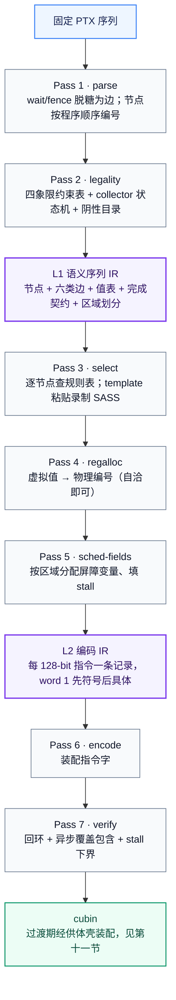

# tcgen05 序列 IR 规范

> 适用范围：PTX ISA 9.0、NVIDIA Thor、`sm_110a`、CUDA 13.0
> 本文性质：自研静态编译器的中间表示规范。输入为顺序固定的 PTX 序列，输出为 SASS 指令字。
> 证据锚点：本规范的每条结构性决策都对应一项已入库的实验发现或一条显式范围裁决，见第二节对照表；引用的探针可由 [probes/run_gap_probes.py](probes/run_gap_probes.py) 复现。
> 规则来源：本文不复述任何映射规则。指令选择的权威来源见 [tcgen05.mma/AI_入口_权威源指引.md](tcgen05.mma/AI_入口_权威源指引.md) 与各指令套件的规则 JSON；IR 只按 `rule_id` 引用它们。

## 一、定位与范围

目标：把一段顺序固定的 tcgen05 PTX 序列，确定性地翻译成带正确调度控制字段的 SASS，并使每条输出指令可审计回其依据的规则与证据。

定位：这是一层 target-specific 的序列 lowering IR，不是通用 PTX 编译器 IR；其全部简化（无调度器、无 CFG、确定性选择）都以固定序列域为前提。

非目标（显式排除）：

- 指令重排与任何优化——程序顺序即**静态发射序**（本 IR 决定发射顺序与依赖字段，不建模 warp 调度器的实际执行时序，二者不是同一概念）；
- 循环、跨基本块数据流、CFG SSA 构造与 phi——输入是直线序列，guard 产生的分支按区域处理；pass 1 的线性定值重命名（第四节）不在此排除之列；
- 描述符与 idesc 内部字段建模——沿用项目"不透明值"裁决；
- 运行时语义验证——沿用 `STATIC_ONLY` 口径；
- 复现 ptxas 的物理寄存器编号与屏障索引——只要求自洽且依赖边为 ptxas 结果的超集。

## 二、设计决策与证据对照

| 决策 | 依据 |
|---|---|
| 程序顺序即静态发射序，无调度器、无 CFG SSA（仅线性定值重命名） | 范围裁决：项目目标"顺序固定的固定 PTX 搭配" |
| 两层结构，语义边与编码字段分离 | `probe:async_depth`：同一 semantic form 在不同调度区域上下文下 word 1 不同，编码必须后期绑定 |
| 序列为复用单位，模板整段粘贴 | `probe:splice`：拆段重拼时等待被编译器消除 |
| 操作数记角色槽与虚拟值，不记物理编号 | `probe:template_idesc`：换模板物理编号全变、槽位角色不变；五槽位 bitfield 位置已冻结 |
| 寄存器类（R/UR/P/UP）是值类型的一部分 | `probe:gpr_pressure`：GPR 压至 R165 与 UR 域正交 |
| `anti` 边独立成类 | STTM/UTCHMMA 实测设置读屏障，异步读源期间源寄存器不可覆盖 |
| `async` 边按队列建模而非逐对建模 | 队列内按序完成：9 条在飞 LDTM 仅消耗 4 个屏障 |
| `wait::ld`、`tcgen05.fence` 解析为边而非节点 | 二者实测零指令；`fence` 仅剩 NOP 定界 |
| `wait::st` 为 hybrid 节点 | 实测产生 `FENCE.VIEW.ASYNC.T`，12/12 组合成立 |
| alloc 族不进选择器，走录制模板 | 其 lowering 为含自旋、影子状态、trap stub 的合成协议；参数空间封闭（32 模板） |
| 资源状态边（collector/TMEM/commit 域）独立成类 | 这些约束不由寄存器承载，数据流边结构性抓不到 |

## 三、总体结构



序列化格式一律 JSONL，与仓库既有 manifest 风格一致；每行一个对象，`schema_version` 起始。

## 四、值模型

```json
{"schema_version": "tcgen05_ir_value_v0",
 "id": "%v8",
 "class": "UR64",
 "role": "B_desc",
 "opaque": true,
 "def": "n7",
 "lifetime": "async_read_source",
 "provenance": {"ptx_reg": "%desc_b"}}
```

| 字段 | 约定 |
|---|---|
| `class` | `R32`、`R64`、`UR32`、`UR64`、`PRED`、`UPRED`、`IMM`。R 与 UR 是不同寄存器文件，禁止合并编号空间；`IMM` 为立即数值（带 `value` 字段），不占寄存器文件，pass 4 跳过 |
| `role` | 目标指令的角色槽名：`A`、`B`、`D`、`aux`、`idesc`、`enable`、`mask`、`taddr`、`mbar` 等。角色顺序属 ISA 层事实（五槽位 bitfield 已冻结），物理编号不属于 |
| `opaque` | 描述符、idesc、TMEM 地址标记为 true：IR 不解释其位内容，只跟踪定值与使用 |
| `def` | 定值节点 id。PTX 虚拟寄存器允许复定义（如 `mov %s,0; xor %s,%s,%r0`），pass 1 对每个定值点重命名为新虚拟值——即仅线性定值重命名，无 CFG SSA 构造。重命名后值表单定值 |
| `lifetime` | 活跃延伸类，pass 4 直接消费：`normal`（终于最后使用点）、`async_write_pending`（定值为异步写，延伸至覆盖 drain 点）、`async_read_source`（被异步读源消费，延伸至该消费者的读屏障覆盖点）、`resource_owned`（TMEM 区间，alloc 至 dealloc）。由 pass 1 从定值/使用上下文推导后物化——单一真相源是节点上下文，本字段是缓存，二者不一致视为 pass 1 缺陷 |

## 五、L1 语义序列 IR

### 5.1 节点

```json
{"schema_version": "tcgen05_ir_node_v0",
 "id": "n3",
 "kind": "op",
 "ptx": "tcgen05.ld.sync.aligned.16x64b.x1.b32 {%r0}, [%taddr];",
 "opcode": "tcgen05.ld",
 "sf": {"shape": "16x64b", "repeat": 1, "pack": false},
 "slots": {"taddr": "%v1", "dst": ["%v3"]},
 "queue": "ld",
 "emits": 1,
 "guard": null,
 "region": "r0",
 "provenance": {"source_line": 12}}
```

| `kind` | 覆盖 | 约定 |
|---|---|---|
| `op` | mma、cp、ld、st、shift、commit | 一条 PTX 一个节点。`16x32bx2` 不拆分：`emits: 2`，1:N 关系封在节点内，归属以 PTX 节点为准 |
| `template` | alloc、dealloc、relinquish | 不透明录制块。声明字段：`template_id`（32 个录制模板之一）、`defs`（如 alloc 产出的 taddr）、`footprint`（UR/GPR/SMEM 占用 **及 scoreboard 维度：内部使用的屏障集与入口前提**，见第十节）、`reloc`（内嵌代码偏移立即数与 REL 位移的重定位表）、`traps`（内含 trap stub 列表）。选择器不得展开其内部 |
| `hybrid` | `wait::st` | 既发射 `FENCE.VIEW.ASYNC.T` 又充当 st 队列的 drain 点；节点带 `drains: "st"` 与 `emits: 1`。注意用 `drains` 而非 `queue`——它不是队列成员，不参与"队列成员按程序序编号"，否则会产生指向自身的 `async` 边 |
| `sync` | `bar.sync`、mbarrier 操作、`membar`/`fence.*` | 真实指令节点；`tcgen05.fence` 的 order 边以此类节点为端点 |

`wait::ld` 与 `tcgen05.fence` **没有节点类**——parse 阶段脱糖为边后即丢弃（见 5.3）。

### 5.2 边

```json
{"schema_version": "tcgen05_ir_edge_v0",
 "kind": "data",
 "from": "n3", "to": "n5",
 "value": "%v3"}
```

| `kind` | 语义 | 生成来源 | 对编码层的含义 |
|---|---|---|---|
| `data` | RAW：先写后读 | 值表 def/use 扫描 | 生产者为可变延迟时消费者 wait 其写屏障；生产者为固定延迟时由发射路径 stall 承担（第六节 stall 构造规则、pass 7(c)），不占屏障 |
| `anti` | WAR：异步读完成前源不可覆盖 | 异步读源指令（STTM、UTCHMMA 的 TS/SS 源）与后续覆盖者 | 覆盖者需要 wait 生产者的**读屏障** |
| `mem` | 通用访存序 | 全部 may-alias 的 `st/ld.global`、`shared` 访存按程序序构成保守链（含 volatile/strong） | 编码层按程序序发射并依赖同地址访存的流水线序；此为显式裁决而非留白。寄存器层 WAW 经 pass 1 重命名后在 L1 不存在，物理层重写序由 pass 4 活跃区间规则承担 |
| `async` | 队列成员的程序序（**结构事实**，投影二可核） | `queue` 相同的节点按程序序隐含；wait 脱糖强化 | 边自身不决定编码；编码行为由该队列在 5.5 声明的完成契约决定，无已验证契约的队列按逐生产者屏障保守处理 |
| `resource` | 硬件状态约束 | collector 通道状态机、TMEM 区间（alloc 定义至 dealloc 释放）、commit 覆盖域（该 commit 提交此前本队列全部异步操作） | 禁止跨边插入冲突操作；不产生 wait，产生合法性与排序约束 |
| `order` | 纯排序 | `tcgen05.fence::{before,after}_thread_sync` 相对最近 `sync` 节点 | 编码层不得让 tcgen05 异步操作跨越该边（当前编译器以指令顺序天然满足；见第十二节未决项） |

### 5.3 wait / fence 脱糖规则

| PTX | 脱糖结果 |
|---|---|
| `tcgen05.wait::ld.sync.aligned;` | 对 ld 队列中所有在飞节点，向 wait 之后第一个节点加 `async` 边（drain 点落在该节点，无论其是否消费队列结果——wait 语义与消费者存在性无关，不得静默丢弃）；编码层行为由该队列的完成契约（5.5）决定：契约在界内则只等最后一个在飞生产者，否则逐生产者等待 |
| `tcgen05.wait::st.sync.aligned;` | 生成 `hybrid` 节点（发射 `FENCE.VIEW.ASYNC.T`）；`async` 边方向为各在飞 st 队列节点 → 该 hybrid 节点（drain 点即此节点自身），其后为源寄存器可安全覆盖的起点 |
| `tcgen05.fence::before_thread_sync;` | 为此前每个 tcgen05 异步节点加一条 `order` 边：from=该异步节点，to=下一个 `sync` 节点 |
| `tcgen05.fence::after_thread_sync;` | 为此后每个 tcgen05 异步节点加一条 `order` 边：from=上一个 `sync` 节点，to=该异步节点 |

依据：`wait::ld` 零指令由单因素对照证实（probe:wait_diff——有/无 wait 两 kernel 助记符序列相同，唯一差异是相邻 `LDCU.64` 的 word 1 由 `0x000e64` 变 `0x000e62`）；`tcgen05.fence` 零指令见 fence 套件 26 case 差分；`wait::st` 实测发射真实指令（wait 套件 12/12）。

### 5.4 区域

调度区域 = 单入口直线段。guard 有两条降级路径：直接谓词化不产生区域边界，在节点 `guard` 字段（`{"pred": "%v9", "sense": true}`）表达；外围控制流降级（ELECT 选举环、分支跳过）产生区域边界。屏障变量的作用域是区域；区域出口执行全量 drain（等待全部在飞屏障归零后方可离开区域），使区域间不携带在飞状态；该保守策略维持至回收策略被实验刻画（第十二节）。

### 5.5 完成契约

```json
{"schema_version": "tcgen05_ir_contract_v0",
 "queue": "ld",
 "contract": "last_covers_all",
 "verified_scope": "单队列、单区域",
 "evidence": "第十三节裁决（probe:consume_order_v2）",
 "fallback": "per_producer_barriers"}
```

契约与边分离的理由：`async` 边是投影二可核验的结构事实（队列成员与程序序），完成覆盖是投影三之上的机制解释（第十三节：编译器契约层）。二者绑定会让机制假设污染 IR——若某队列将来被发现发射 FIFO 而完成非 FIFO，受影响的只是该队列的契约声明与 pass 5 行为，边结构与全部已生成的 L1 产物不变。

规则：pass 5 仅对持有已验证契约、且当前序列落在其 `verified_scope` 内的队列，应用"等最后成员即覆盖全队列"；契约缺失或越界（混合队列、跨区域）一律回退 `fallback`。跨队列覆盖无契约可依，永远不得假设。当前已声明的契约仅 ld 队列一条（上示）；st、mma、cp 队列待混合队列实验（第十四节最高优先级）后登记。

## 六、L2 编码 IR

```json
{"schema_version": "tcgen05_ir_enc_v0",
 "node": "n4",
 "seq": 3,
 "mnemonic": "LDTM",
 "modifiers": ["16dp64bit"],
 "operands": [{"slot": "dst", "phys": "R5"},
              {"slot": "taddr", "phys": "UR4", "form": "tmem"}],
 "word1_sym": {"wait": ["b0"], "wr_barrier": "b1", "rd_barrier": null,
               "stall": "min", "yield": null, "reuse": []},
 "word1": "0x001e620008060000",
 "rule_id": "tcgen05.ld.forward.000007",
 "evidence_grade": "OBSERVATION"}
```

| 字段 | 约定 |
|---|---|
| `mnemonic`/`modifiers` | 由 pass 3 查权威规则表得出，本层不推导 |
| `operands[].phys` | pass 4 产物。只要求自洽：同值同编号、类不混用；不要求与 ptxas 一致 |
| `word1_sym` | 屏障是变量 `b0..b5`。stall 符号构造规则：与下一条发射指令存在**无屏障保护**的固定延迟依赖时记 `LAT(生产集->消费集)`；该依赖被屏障保护或不存在依赖时记 `min`。pass 5 前禁止出现具体索引与周期数 |
| `word1` | pass 5/6 落成的具体值。字段布局沿用 [tools/decode_ctrl.py](tools/decode_ctrl.py) 的假设（wait[57:52]、rd[51:49]、wr[48:46]、yield[45]、stall[44:41]、reuse[61:58]），该布局在 `sm_110a` 上待 Thor 复核 |
| `emits` 展开 | L2 记录粒度=发射指令：`emits: n` 的节点产生 n 条记录（`node` 相同、`seq` 连续）；操作数分裂（如 `16x32bx2` 的半列偏移与 dst 递增）由 pass 3 所引规则的 1:N 展开表定义；`word1_sym` 逐记录持有；节点属队列时由末条记录承载 `wr_barrier`（完成覆盖按记录计） |
| `reuse` | v0 裁决：恒置 0。不置恒安全（仅损失操作数复用缓存的端口收益），错置可能读到陈旧操作数；性能层留待 v1。模板字内 ptxas 已置的 reuse 位随字原样保留 |
| `rule_id`/`evidence_grade` | 强制字段，对全部记录生效（含外围指令）。tcgen05 指令引各套件规则 JSON；外围指令引对应指令族研究或 `peripheral_select_v0` 表（见第八节）；template 粘贴记 `template_id` 与录制哈希 |

## 七、Pass 契约

| pass | 输入不变量 | 输出保证 |
|---|---|---|
| 1 parse | 合法 PTX 文本、顺序固定 | 节点/值/边表；wait 与 fence 已脱糖；队列成员按程序序编号 |
| 2 legality | L1 全表 | 每节点通过约束检查，或整体 REJECT 并给出违反的约束 id。检查项包括：collector 状态机路径、alloc 与 dealloc 各自的 ncols 约束（二者不对称）、变体与限定符联合合法性、操作数形态。约束表按四象限验证维护 |
| 3 select | 合法 L1 | 每 `op`/`hybrid` 节点得到 mnemonic、modifiers、操作数形态与 `rule_id`；每 `template` 节点得到录制 SASS 与哈希。禁止对无规则覆盖的形态凭插值生成——查不到即 REJECT_OUT_OF_DOMAIN |
| 4 regalloc | 选择完成 | 虚拟值到物理编号的自洽映射；R/UR/P/UP 分文件；活跃区间不冲突。硬约束：`R64`/`UR64` 类的物理起始编号必须偶对齐（实测全部 `LDC.64`/`LDCU.64` 落偶起始寄存器对），"自洽即可"不豁免此条。异步定值专项规则：异步写目的值（LDTM 结果等）的活跃终点不是最后使用点，而是覆盖其队列成员身份的 drain 点——即使无任何消费者（本编译器不做 DCE，无消费者的异步写照常发射且必须保持跟踪）；在此之前其物理寄存器不得重分配，重分配点若早于完成必须先等待对应屏障（WAW 保护） |
| 5 sched-fields | 编号完成 | 每 `word1_sym` 的屏障变量落成索引：数据/anti 边的生产者放写/读屏障，消费者填 wait；同队列按 5.5 契约应用"最后生产者"覆盖（契约缺失或越界回退逐生产者屏障）；变量数超出 6 时按回收策略插入 drain。策略未定前保守：完全串行化，即同一时刻至多一个在飞异步操作，发射后立即等待其屏障再发射下一条——与第十二节"禁用单屏障共享并发形态"一致。`template` 节点是屏障 clobber 点：入口前全量 drain（满足模板的记分牌入口前提，如 alloc 模板内 `DEPBAR.LE SB0, 0x36` 的阈值等待），出口后视全部屏障状态为未知并重新分配——当前串行化策略下该规则自动成立，放开并发后成为显式义务。stall 由官方延迟表查得，查不到取最大值 |
| 6 encode | 字段完整 | 128-bit 指令字；word 0 按已冻结槽位 bitfield 填充 |
| 7 verify | cubin | 三项判据：(a) nvdisasm 回环，助记符/修饰符/操作数形态与 L2 一致；(b) 若存在 ptxas 参照，异步覆盖包含检查。比较域限定为异步完成覆盖关系：生产者取两侧均可按助记符族识别的 tcgen05 异步指令，关系为"该生产者在其结果首次被使用前是否被某次 wait 覆盖"，生成侧关系集须为参照侧超集；比较前剔除参照側屏障回收边（`tools/decode_ctrl.py` 的 reclaim 分类）。不以任意指令对为端点逐条比边——参照侧经 ptxas 折叠与消除后与生成侧不同构（第九节 xor 折叠进 STG 即实例），逐条比对不可机械执行；固定延迟依赖不入 (b)，由 (c) 承担；(c) 每个无屏障保护的固定延迟定值-使用对，其间发射路径 stall 之和不低于延迟表下界——延迟表未对齐前生成侧强制最大 stall，(c) 平凡成立，此为显式声明而非验证盲区 |

关于"屏障分配反向影响指令选择"的风险（通用后端中成立）：v0 域内该反馈环不存在——pass 3 是零自由度的确定性查表，固定 PTX 形态唯一决定 SASS 形态，屏障分配没有可影响的选择点。此论断的前提是"每形态唯一映射"；若 v1 引入性能层的多形态选择，前提失效，须重估管线单向性。

## 八、合法性层的数据来源

pass 2 不内嵌规则文本，只装载：

- `tcgen05.mma/thor_ptx90/results/rule-mining/canonical_mapping_rules.json`（896 条正向规则）；
- 各指令套件 `validation/` 与阴性目录；
- 本仓库审查文档新增的约束（alloc 2 的幂 / dealloc 32 的倍数、`red × pack` 非法、multicast 与 mask 强配对、`.cta_group` 不可省略等），登记入各套件 factors.json 的 `constraints` 字段后由此装载（该字段已存在于全部 10 个套件但当前均为空数组，登记本身仍是待办）。

外围指令的选择来源（v0 裁决）：序列中非 tcgen05 的 PTX 指令（`ld.param`、`mov`、`add`、`xor`、`st.global`、`bar.sync` 等）不在 tcgen05 规则 JSON 覆盖内。其选择层来源分两级：优先引用仓库内对应指令族的映射研究（如 `verification_num_mapping/results/mapping_report.csv` 已含 `14_bit_ops` 等族的 PTX→SASS 对照），无族覆盖的用一张显式的外围最小映射表（`peripheral_select_v0`，如 `ld.param.b32`→`LDCU`/`LDC`、`st.global.b32`→`STG.E`），该表与 tcgen05 规则同样带证据锚点、同样受四象限维护。禁止把外围指令当"显然的"而免除来源登记——第九节示例的 `LDCU`/`STG` 记录即须引用此表。

维护规则：发现象限三/四实例（预期非法但接受、预期合法但拒绝）时，先改约束表并重跑四象限，再改 IR。

## 九、完整示例

输入 PTX（对应 `probes/results/async_depth_1.ptx`）：

```ptx
ld.param.b32 %taddr,[p_t];
ld.param.b64 %o,[p_o];
tcgen05.ld.sync.aligned.16x64b.x1.b32 {%r0},[%taddr];
tcgen05.wait::ld.sync.aligned;
mov.b32 %s,0;
xor.b32 %s,%s,%r0;
st.global.b32 [%o],%s;
```

L1（完整闭合，仅省略每行的 schema_version；`%s` 的两次定值经 pass 1 重命名为 `%v4` 与 `%v5`）：

```json
{"id":"%v1","class":"UR32","role":"taddr","def":"n1","opaque":true,"lifetime":"normal"}
{"id":"%v2","class":"R64","role":"out_addr","def":"n2","opaque":false}
{"id":"%v3","class":"R32","role":"dst","def":"n3","opaque":false,"lifetime":"async_write_pending"}
{"id":"%v4","class":"IMM","value":0,"def":"n4","opaque":false}
{"id":"%v5","class":"R32","role":"acc","def":"n5","opaque":false}

{"id":"n1","kind":"op","opcode":"ld.param.b32","slots":{"dst":["%v1"]},"guard":null,"region":"r0"}
{"id":"n2","kind":"op","opcode":"ld.param.b64","slots":{"dst":["%v2"]},"guard":null,"region":"r0"}
{"id":"n3","kind":"op","opcode":"tcgen05.ld","sf":{"shape":"16x64b","repeat":1,"pack":false},
 "slots":{"taddr":"%v1","dst":["%v3"]},"queue":"ld","emits":1,"guard":null,"region":"r0"}
{"id":"n4","kind":"op","opcode":"mov.b32","slots":{"dst":["%v4"]},"guard":null,"region":"r0",
 "note":"mov %s,0 的定值；字面量 0 由 %v4 的 value 字段承载，无 src 槽，pass 3 可折叠"}
{"id":"n5","kind":"op","opcode":"xor.b32","slots":{"a":"%v4","b":"%v3","dst":["%v5"]},"guard":null,"region":"r0"}
{"id":"n6","kind":"op","opcode":"st.global.b32","slots":{"addr":"%v2","src":"%v5"},"guard":null,"region":"r0"}

{"kind":"data","from":"n1","to":"n3","value":"%v1"}
{"kind":"data","from":"n3","to":"n5","value":"%v3"}
{"kind":"async","from":"n3","to":"n4","queue":"ld","note":"wait::ld 脱糖；队列仅 n3 在飞。drain 点=wait 后第一个节点 n4（mov），即使它不消费队列结果——n4 可能被 pass 3 折叠，但 L1 不预知折叠结果"}
{"kind":"data","from":"n4","to":"n5","value":"%v4"}
{"kind":"data","from":"n2","to":"n6","value":"%v2"}
{"kind":"data","from":"n5","to":"n6","value":"%v5"}
```

注意两点：PTX 第 4 行（`wait::ld`）在 L1 中没有节点——只剩那条 `async` 边；PTX 里 `%s` 被写两次，L1 里是 `%v4`、`%v5` 两个值（定值重命名，见第四节）。

L2（关键三条；`word1` 为该探针实测值，`word1_sym` 为本 IR 的生成形态）：

```json
{"node":"n1","mnemonic":"LDCU","operands":[{"slot":"dst","phys":"UR4"}],
 "word1_sym":{"wait":[],"wr_barrier":"b0","stall":"min"},
 "word1":"0x000e2e0008000800",
 "rule_id":"peripheral_select_v0.ld_param_b32","evidence_grade":"OBSERVATION"}
{"node":"n3","mnemonic":"LDTM","modifiers":["16dp64bit"],
 "operands":[{"slot":"dst","phys":"R5"},{"slot":"taddr","phys":"UR4","form":"tmem"}],
 "word1_sym":{"wait":["b0"],"wr_barrier":"b1","stall":"min"},
 "word1":"0x001e620008060000",
 "rule_id":"tcgen05.ld.forward.<待引用：ld 套件 results 重跑后按 manifest 回填>","evidence_grade":"OBSERVATION"}
{"node":"n6","mnemonic":"STG.E","word1_sym":{"wait":["b1"],"stall":"min"},
 "word1":"0x002fe2000c101904",
 "rule_id":"peripheral_select_v0.st_global_b32","evidence_grade":"OBSERVATION"}
```

对照实测 SASS（`probes/results/async_depth_1.disasm.txt`）：`LDCU UR4` 置 b0（SB0），`LDTM` 等 b0、置 b1（SB1），`STG` 等 b1——与 `word1` 逐值吻合。xor 被 ptxas 折叠进 STG 路径的现象属于优化域，本 IR 不追求复现，verify 只要求边包含成立。

## 十、模板节点的录制与粘贴契约

| 项 | 约定 |
|---|---|
| 录制 | 每个 `template_id` 对应一次 ptxas 整段编译的产物：SASS 指令字（含 word 1）、参数槽位映射、UR/GPR 足迹、trap stub 符号。记录工具版本与 SHA-256 |
| 粘贴 | 只允许替换：常量 bank 偏移、TMEM 地址来源，以及按 `reloc` 表重定位的代码偏移。v0 禁止模板内寄存器重编号——模板字含 ptxas 已置的 reuse 位与寄存器对偶对齐约束，重编号需同时重验二者，收益不抵风险 |
| 禁止 | 截取模板片段拼接（`probe:splice` 证据）；跨模板复用内部标签与影子状态偏移 |
| 边界 | 模板与外部代码的接口按 `template` 节点的 `defs`/`footprint` 建边，内部不建边 |

### 模板的隐式环境依赖

录制产物比"不透明值"裁决所假设的更不自由：它携带位置与记分牌状态的隐式依赖，三项均有入库实测（probe:alloc_lifecycle）：

1. **记分牌前提**。模板内部使用屏障并对入口状态有硬性假设：alloc 模板含两处 `DEPBAR.LE SB0, 0x36`（阈值等待）。外部代码带着 SB0 在飞计数进入会使阈值等待误放行或死等。承接：`footprint` 的 scoreboard 维度申报内部使用集与入口前提，pass 5 把模板当屏障 clobber 点。当前完全串行化策略下入口恰好全清——这是巧合不是契约，放开并发前必须落契约。
2. **位置依赖**。trap 返回地址以绝对 `.text` 偏移作立即数嵌在指令流中（`MOV R2, 0x220/0x450/0x480` 紧邻 `CALL.REL.NOINC`），`CALL.REL` 位移依赖模板与 stub 的相对距离，且 stub 内 `RET.REL.NODEC R2` 的编码以**内核符号**为基准（负位移 `0xfffffff8...`）。模板粘贴到异于录制的偏移，三个返回地址与全部 REL 位移同时失效。承接：录制时生成 `reloc` 表（代码偏移立即数位置 + REL 位移字段位置），粘贴按落点差量重定位。
3. **随体代码**。模板引用 `.weak $__internal_*` trap stub 系列，stub 是独立符号的真实代码段，必须随模板注入并参与重定位（见第十一节）。

根因一句话：模板不是一个值，是一段带环境假设的程序；接口面必须按程序对待。

## 十一、ELF 装配过渡方案

在 P1-4（装配层建模）完成前，采用供体壳：以 ptxas 编译一个参数签名相同、寄存器申报不小于实际用量的壳 kernel，替换其 `.text` 段指令字，沿用其 `EIATTR_*` metadata 与符号表。约束：生成代码的 GPR/UR 用量与 SMEM 占用不得超过供体申报值，verify 阶段核对。含 template 的序列还须把其引用的 `.weak $__internal_*` trap stub 一并注入 `.text`，并按落点重定位 `CALL.REL` 位移与 stub 内以内核符号为基准的 `RET.REL.NODEC` 位移（见第十节"模板的隐式环境依赖"），供体壳符号表相应补登。此方案只用于打通端到端验证，不是交付形态。

## 十二、未决问题（与审查 P0 对齐）

| 问题 | 阻塞的 pass | 当前策略 |
|---|---|---|
| word 1 字段布局在 `sm_110a` 上未经 Thor 复核 | 5、6、7 | 沿用自洽假设，Thor 上按 tools/README 步骤 3.2 复核后升级 |
| 屏障语义是计数器还是标志位 | 5 | 静态强证据支持计数器（第十三节补录：SB1 三异构生产者共享 + `DEPBAR.LE` 阈值语义）；保守策略维持至 Thor 运行时确认 |
| 屏障回收策略 | 5 | 保守：区域边界与变量耗尽时全量 drain |
| 延迟表向量与 `UDP_subset` 成员的逐位对齐 | 5 | 未对齐项 stall 取最大值 |
| `DEPBAR.LE SB0, 0x36` 的阈值语义（54 的含义：队列深度上限？编码单位？） | 模板 footprint 的入口前提申报 | 仅用于计数器佐证，不据此生成 DEPBAR；Thor 上可变前序深度差分测定 |
| `order` 边在何种上下文下真正约束编译产物 | 2、7 | fence 套件已记录"当前不可观测"，出现可观测实例前 order 边仅作合法性标记 |
| 序列组合矩阵（P0-3） | 全部 | IR 支持任意序列，但已验证域以套件覆盖为准；域外序列标记 OUT_OF_VALIDATED_DOMAIN 仍可生成，verify 强制走 oracle 对照 |

## 十三、观察与机制假设的分离

本规范及其引用文档必须区分三个层级：**观察**（原始机器字与指令文本）、**机制假设**（对观察的解释）、**裁决**（区分实验的结果）。任何 pass 依赖的性质都必须标注其所处层级。

示范案例——5.5 完成契约（`async` 边的编码含义来源）所依赖的完成覆盖性质：

```text
观察（probe:async_depth）：
9 条在飞 LDTM 只使用了 4 个屏障。

假设 A：等待下标最大的在飞队列成员即覆盖其余（完成有序或等价机制）。
假设 B：ptxas 在每个消费边界独立设置屏障，与队列顺序无关。

第一次区分实验（probe:consume_order，xor 链消费）：
  处理变量失真——ptxas 把 xor 链重结合为 LOP3 归约树，PTX 层的
  消费顺序未存活到 SASS。该轮 inorder/interleave 臂不构成独立证据，
  失真本身作为混杂记录保留。

修正实验（probe:consume_order_v2，每个结果由一条 st.volatile.global
独立消费；先在投影二核验 SASS store 顺序与设计一致，三种顺序全部保序）：
  inorder / reverse / interleave 三种顺序结果完全相同——
  六条 LDTM 中仅 #6 携带写屏障（SB1）；
  该屏障同时被另外两个异构生产者设置：
    0020 LDC.64（out 指针，mio 管线）与 0090 LDCU.64（描述符重载，udp 管线）；
  仅第一条 STG 等待 SB1 一次；
  LDTM#1–#5 无任何完成跟踪，其余五条 STG 零等待。

已声明的混杂：首条 STG 的 wait 同时保护地址、描述符与 LDTM 结果三路
依赖，因此"单次等待覆盖 ld 队列"不是纯净的队列证据；但 LDTM#1–#5 零
跟踪的不变式不受此混杂影响（见下方裁决）。

裁决（范围收紧后）：
  B 被证伪：即便以 SASS 层的真实消费边界衡量，逐边界的独立跟踪不存在。
  A 成立于编译器契约层：五条无跟踪的异步结果被消费，生成代码的正确性
  蕴含"最后成员完成即全体完成"——这是 ptxas 所依赖的硬件契约。
  静态方法不能证明硬件本身按序完成；对本项目而言，需要复刻的正是
  编译器契约，硬件层确认归 Thor 运行时阶段。
层级标注：屏障/等待的解读依赖 decode_ctrl.py 字段布局假设（投影三）；
布局被推翻时仅重做解释层，投影一/二的观察不失效。
```

补录——同一探针数据对第十二节头号未决问题（屏障是计数器还是标志位）的静态证据：三个异构生产者（LDC.64 / LDTM / LDCU.64，跨 mio 与 udp 管线）共享 SB1、三者完成时点各异、单次 wait 即全部覆盖。若屏障是单比特标志，后设置者会丢失先前生产者的跟踪，除非存在跨管线完成序契约——而 mio 与 udp 之间不存在已知的此类契约。独立佐证：alloc 生命周期 lowering 含 `DEPBAR.LE SB0, 0x36`（probe:alloc_lifecycle，两处；另见已跟踪的 `verification_num_mapping/sass_dumps/01_tcgen05__T08_alloc_cg1_O0.sass:393`），阈值等待（记分牌值 ≤ 阈值）语义只对计数器成立。两条证据同指计数器。该问题状态从"未测"升级为"静态强证据支持计数器，保守策略维持至 Thor 运行时确认"。

方法教训（已上升为第十五节的强制规则）：处理变量必须先在投影二核验存活，才允许进入投影三/四的解释。v1 的失误正是跳过了这一步；本节补录的 SB1 共享现象在首轮解读中同样被漏读——完整解码全部指令而非只看目标助记符，同属该规则的适用范围。

副发现一（probe:consume_order 的 partial 变体，归类为独立的 DCE 实验，不算消费顺序档位）：无消费者的 `tcgen05.ld` 会被 ptxas 整条死代码消除，`tcgen05.st` 因存储副作用不受影响。推论：任何"构造在飞队列"的实验必须给每个队列成员配消费者，否则队列坐标名不副实；wait 套件受此影响的 case 已按此口径加注。

副发现二（probe:consume_order_v2）：`st.volatile.global` 降级为 `STG.E.STRONG.SYS`，volatile 以 sys 作用域强存储实现。

## 十四、序列组合矩阵（下一阶段实验轴）

以下矩阵是 P0-3（序列组合）的正式实验计划。"已覆盖"指已有入库探针或已跟踪的套件产物触及该轴的部分档位，不代表该轴完成。

| 实验轴 | 档位 | 状态 |
|---|---|---|
| 异步深度 | 1、2、4、6、9 | 已覆盖（probe:async_depth） |
| 消费顺序 | 顺序、逆序、交叉 | 已覆盖（probe:consume_order_v2，volatile 保序版；v1 因重结合失真仅作混杂记录） |
| 死代码消除 | 部分消费、零消费 | 部分覆盖（consume_order 的 partial 变体；zero 档位未做） |
| 生产者到消费者距离 | 0、1、2、4、8 条指令 | 未覆盖 |
| 异步类型 | LD、ST、MMA、CP、混合 | 单类型已覆盖，混合未覆盖 |
| 完成点 | 无、wait::ld、wait::st、commit | 部分覆盖（套件层） |
| fence 位置 | 无、before、after、before+after | 部分覆盖（fence 套件，效应尚不可观测） |
| 序列组合 | A、B、A+B、B+A、A+无关前缀 | A/B/A+B 已覆盖（probe:splice），B+A 与无关前缀未覆盖 |
| 区域边界 | 无 guard、直接谓词、外围分支 | 部分覆盖（mma 上下文矩阵） |
| 寄存器复用 | 不复用、立即复用、延迟复用 | 未覆盖 |
| 优化级 | O0、O1、O2、O3 | 套件层已覆盖，序列层未覆盖 |

优先级：混合异步类型（检验队列独立性，直接决定 `async` 边的队列划分是否正确）、B+A 对照（检验控制位是否依赖前缀状态，决定模板复用边界）、生产者-消费者距离（检验屏障放置策略随距离的变化）。这三项做完前，pass 5 的屏障分配只允许保守策略。

## 十五、证据四投影

每次实验的产物按四个投影分层保存，低层是事实，高层是解释；解释层出错时只重做解释，不重跑编译：

| 投影 | 内容 | 性质 | 存储责任 |
|---|---|---|---|
| `exact_words` | word0/word1 原始 128-bit 指令字 | 事实 | probes/results 的 disasm 与 summary.json |
| `normalized_sass` | 助记符、修饰符、规范化操作数 | 事实的确定性变换 | 同上（nvdisasm 文本） |
| `decoded_control_fields` | wait 掩码、屏障索引、stall 等字段值 | 基于字段布局假设的解释 | tools/decode_ctrl.py 按需再生，不入库 |
| `inferred_dependency_graph` | data/anti/async 边、回收边分类 | 在投影三之上的进一步推断 | 同上（--json 输出） |

约束：

1. 任何文档引用证据时必须可辨认其所处投影；裁决类结论（如第十三节）至少注明其依赖的最高投影层级。
2. **处理变量存活核验**：区分实验的处理变量（消费顺序、深度、距离等）必须先在投影二上核验其确实存活到 SASS，才允许进入投影三/四的解释。编译器可能重结合、消除或合并处理构造（实例：xor 链被重结合为 LOP3 树、无消费者 LDTM 被 DCE），跳过核验会把编译器变换误读为机制证据。
3. `run_gap_probes.py` 只固化前两层，这是有意设计——字段布局被 Thor 复核推翻时，前两层产物原封不动。

## 十六、版本与演进

- v0（本文）：结构冻结候选。schema 字段可增不可改义；`schema_version` 逐层独立演进。
- 升级到 v1 的条件：Thor 复核字段布局、屏障语义裁决、至少一个完整生命周期序列通过 pass 7 全部三项判据。
- 本规范与权威规则源的关系：IR 引用规则，不复制规则。任何在 IR 文档内复述映射表的修改都应被拒绝（防双重真相原则）。
